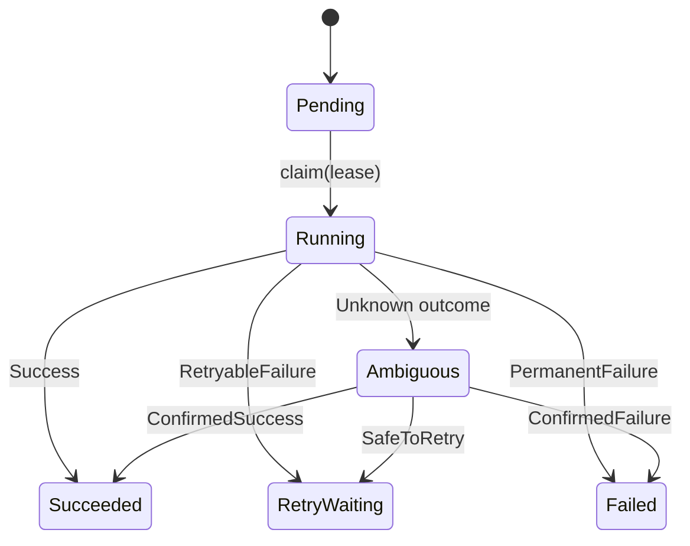

# Domain Entities: Workflow and Activity

**Status:** Implementation draft. This document describes the current domain layer, not guarantees already provided by distributed infrastructure.

## Why these objects exist

The original `WorkflowState` and `ActivityState` enums describe possible states and legal transitions. They do not enforce transitions if other components keep raw states and freely replace them. `Workflow` and `Activity` introduce private state and public operations with explicit error results.

## Ownership and API boundaries

- `Workflow` owns a `WorkflowId` and its current `WorkflowState`.
- `Activity` owns an `ActivityId`, knows which `WorkflowId` it belongs to, and tracks the current attempt and lease token.
- Fields are private. Callers can inspect state, but must request transitions through methods.
- `&self` getters observe state without transferring ownership of the entity. `&mut self` methods perform validated mutations. Small identifier values are `Copy` newtypes.

## Activity claim

`claim(LeaseToken)` is only legal from `Pending`. It assigns a new 1-based attempt and changes state to `Running`. Attempt overflow is checked **before** any state mutation.

The domain layer currently stores a token, but does not establish an expiring lease. A PostgreSQL transaction, lease deadline, and conditional update will be required before this can provide distributed stale-worker protection.

## Completion and unknown outcomes

`finish(&LeaseToken, ActivityOutcome)` checks that the activity is running and the token is the active one. A mismatch rejects the completion without changing state. Unknown outcomes map to `Ambiguous`, not to ordinary `Failed`.

`resolve_ambiguous(Reconciliation)` represents a decision made **after** external evidence was collected. These decisions are separate from normal activity outcomes.

## What this version intentionally does not enforce

- A workflow cannot yet check whether all of its required child activities have finished before entering `Completed`. That requires workflow coordination, not merely a state transition method.
- `RetryWaiting` has no retry deadline or scheduler transition back to `Pending` yet. It cannot immediately claim work again; the storage/scheduler phase will add durable eligibility.
- The domain token check only protects a local entity. Real stale-worker protection requires an atomic database update conditioned on the active lease token (plus an expiry check).
- The module does not know wall-clock time, Tokio, HTTP, or PostgreSQL.

## Testing strategy

The initial tests cover invalid transitions, stale lease tokens, unknown outcomes, and attempt overflow. A property-based test generates sequences of requested workflow transitions and checks that terminal states stay terminal and rejected transitions leave the entity unchanged. Property-based testing complements example-based unit tests; it does not prove distributed correctness.

## Reference

Rust API Guidelines: [Type safety and newtypes](https://rust-lang.github.io/api-guidelines/type-safety.html)

Proptest: [official project](https://github.com/proptest-rs/proptest)
